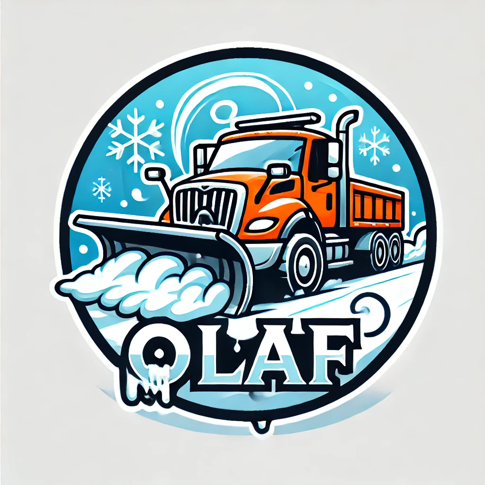

# OLAF - Optimized Logistic via Agent Framework

OLAF (Optimized Logistic via Agent Framework) is an intelligent snow removal management system built using CrewAI that helps municipalities and contractors optimize their snow removal operations through AI-driven decision making.

## Overview

OLAF uses a crew of specialized AI agents working together to handle different aspects of snow removal operations:

- **Global Planner**: Oversees and coordinates overall snow removal strategy
- **Weather Monitor**: Tracks and analyzes weather conditions and forecasts
- **Stock Resources Manager**: Manages inventory of salt and fuel resources
- **Route Optimizer**: Determines optimal snow removal routes
- **Notifications Manager**: Handles stakeholder communications and alerts

## Features

- **Weather Integration**: Real-time weather data collection and analysis
- **Traffic Analysis**: Integration of traffic data for route optimization
- **Resource Management**: 
  - Tracking of salt and fuel inventory levels
  - Smart resource allocation based on weather conditions
- **Route Optimization**: AI-powered route planning considering multiple factors
- **Stakeholder Communication**: Automated report generation and notifications
- **Multiple Operation Modes**:
  - Run: Execute snow removal optimization
  - Train: Train the AI crew with historical data
  - Test: Evaluate system performance
  - Replay: Review previous operations

## Installation

1. Clone the repository:
```bash
git clone https://github.com/yourusername/olaf.git
cd olaf
```

2. Set up a conda environment (recommended):
```bash
conda create -n olaf python=3.10
conda activate olaf
```

3. Install dependencies:
```bash
pip install -r requirements.txt
conda install plotly  # Required for report generation
```

4. Copy the example environment file and configure your settings:
```bash
cp .env.example .env
```

## Usage

OLAF can be run using the crewai command-line tool:

```bash
# Regular execution
crewai run

# Training mode
crewai train <iterations> <filename>

# Test mode
crewai test <iterations> <model_name>

# Replay mode
crewai replay <task_id>

### Alternative Setup (Manual)

If you encounter any issues with the crewai command, you can use the provided shell script:

1. Make the script executable:
```bash
chmod +x run_crew.sh
```

2. Create an alias in your shell configuration (e.g., .zshrc or .bashrc):
```bash
alias crewai="/path/to/olaf/run_crew.sh"
```

3. Reload your shell configuration:
```bash
source ~/.zshrc  # or source ~/.bashrc
```

The script automatically sets up the required environment variables and allows you to use all crewai parameters normally.
```

## Project Structure

```
olaf/
├── src/
│   └── ai_driven_snow_removal_optimization_for_municipalities_and_contractors/
│       ├── crew.py           # Core CrewAI implementation
│       ├── main.py          # Entry point and execution modes
│       ├── tools/           # Custom tools
│       │   ├── local_inventory_tool.py    # Resource inventory management
│       │   └── report_generator_tool.py   # HTML report generation
│       └── config/          # Configuration files
├── reports/                 # Generated HTML reports
├── knowledge/              # Knowledge base
└── db/                     # Database files
```

## Tools

### Local Inventory Tool
- Manages and queries local inventory of resources (salt and fuel)
- Supports semantic search of inventory data
- Maintains real-time inventory levels

### Report Generator Tool
- Generates formatted HTML reports
- Includes timestamps and operation details
- Provides clean, professional layout for stakeholder communication

## Configuration

The system uses several configuration files:

- `.env`: Environment variables and API keys
- `config/agents.yaml`: Agent configurations and roles
- `config/tasks.yaml`: Task definitions and parameters

## Reports

Reports are automatically generated in HTML format and stored in the `reports/` directory. Each report includes:
- Timestamp of generation
- Operation details
- Resource usage
- Route optimizations
- Weather conditions
- Stakeholder notifications
